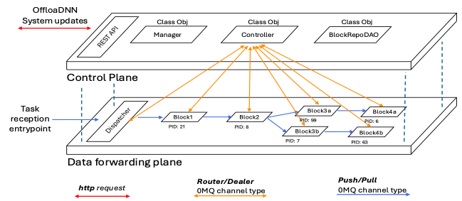
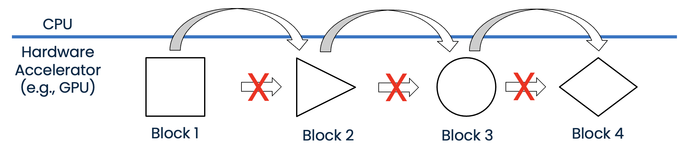
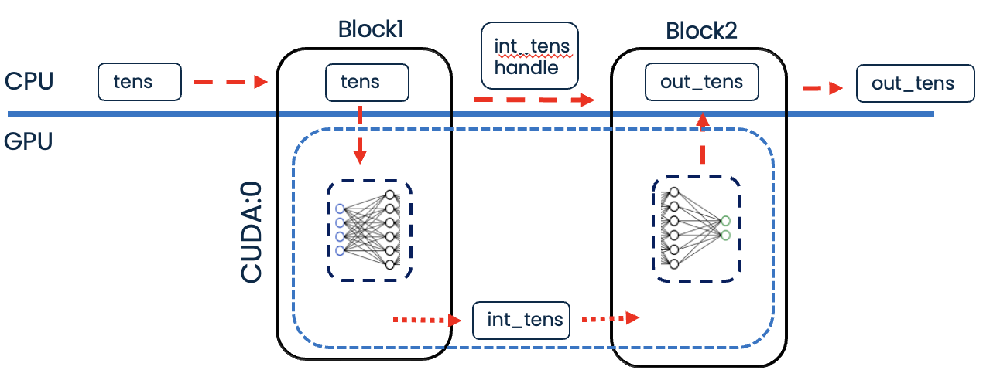
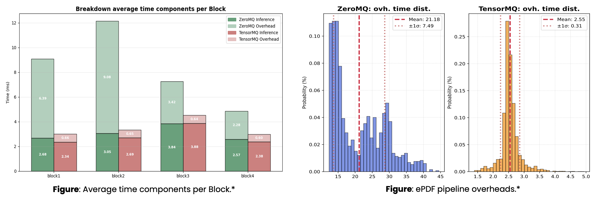
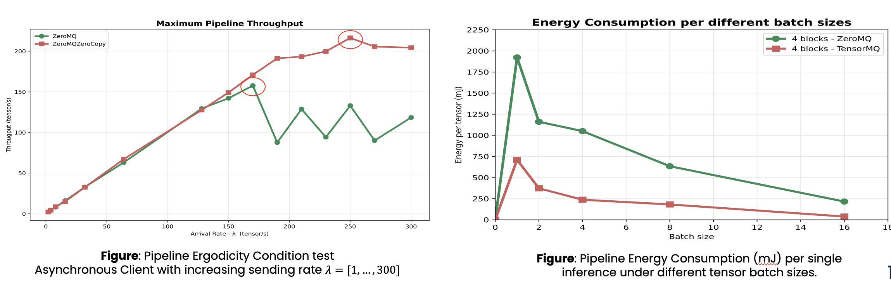

# BlockFlow

**An open-source tool to deploy, manage, and serve modular DNN inference pipelines using efficient, GPU-aware communication.**

BlockFlow is designed to tackle the challenges of deploy mandage and serve modular Deep Neural Networks (DNNs) architectures. It enables a modular approach to inference, where different DNNs can share common layers (blocks), and introduces **TensorMQ**, a novel communication mechanism that reduces the overhead of inter-block communication on GPU-accelerated setups.

_BlockFlow's high-level architecture._

---

## Table of Contents
- [The Problem: The Communication Bottleneck in Modular Inference](#the-problem-the-communication-bottleneck-in-modular-inference)
- [Solution: TensorMQ - GPU-Aware Zero-Copy Communication](#solution-tensormq---gpu-aware-zero-copy-communication)
- [Key Features & Performance Highlights](#key-features--performance-highlights)
- [Architecture](#architecture)
- [Experimental Results](#experimental-results)
  - [Inference Latency](#inference-latency)
  - [System Scalability](#system-scalability)
  - [VRAM Savings](#vram-savings)
  - [Reproducibility](#reproducibility)
- [Future Work](#future-work)
- [Citation](#citation)
- [Acknowledgments](#acknowledgments)

---

## The Problem: The Communication Bottleneck in Modular Inference

Modern DNNs are powerful but are computationally and energy-demanding, making them difficult to deploy on edge devices. A promising approach is offload the computation toward more powerful devices (Edge servers) through telcom networks (task offloading). However, edge server computing and storage resources are still limited thus, it is fundamental to have strategies to optimize them. **Modular inference**, where a DNN is split into smaller, independent **blocks** allows for:

- Sharing common blocks (e.g., early convolutional layers) between different DNN models, saving memory and compute resources.

However, this creates a new challenge: **communication overhead**. When blocks are run as separate processes on a GPU, traditional communication methods (like standard sockets) force a costly data transfer pipeline:

**GPU (Block N) → CPU → System Memory → CPU → GPU (Block N+1)**

This "ping-pong" between the GPU and CPU introduces significant latency and becomes a major performance bottleneck, often negating the benefits of the modular approach.

## Solution: TensorMQ - GPU-Aware Zero-Copy Communication

BlockFlow introduces **TensorMQ**, a novel communication backend built on ZeroMQ and **CUDA Inter-Process Communication (IPC)**. TensorMQ eliminates the GPU-CPU-GPU data transfer entirely for blocks running on the same GPU.

Instead of serializing and sending the entire massive tensor, TensorMQ works as follows:
1.  **TX Block (Sender):** Obtains a handle to the tensor's memory location on the GPU. This IPC handle is a very small object (~180 bytes).
2.  The handle is sent to the next block via a lightweight ZeroMQ message.
3.  **RX Block (Receiver):** Receives the IPC handle and uses the CUDA API to directly access the tensor data from the sender's GPU memory, creating a zero-copy mapping.

This turns a multi-megabyte data copy into a tiny metadata exchange, resulting in a small, constant, and predictable communication overhead.

_Comparison between traditional communication and TensorMQ's zero-copy approach._

## Key Features & Performance Highlights

BlockFlow, powered by TensorMQ, delivers significant performance improvements over traditional modular inference systems:

- 🚀 **Drastic Latency Reduction:** Achieves an **8.30x reduction** in communication overhead, bringing the end-to-end latency of a modular pipeline much closer to that of a monolithic model.
- ⚡️ **Increased Throughput:** Demonstrates a **+42% increase** in system throughput under heavy load on the same hardware.
- 🔋 **Reduced Energy Consumption:** Achieves a **~2.43x reduction** in energy consumption per inference.
- 💾 **VRAM Efficiency:** The modular deployment strategy can save up to **23% of VRAM** when tasks share a high percentage of their layers, allowing more models to run on a single device.
- 🧩 **Modular & Branchy Architecture:** Natively supports the deployment of decomposed DNNs and the sharing of blocks across multiple inference pipelines, as envisioned by frameworks like [OffloaDNN](https://ieeexplore.ieee.org/abstract/document/10579606).

## Architecture

BlockFlow is composed of two main planes:

1.  **Control Plane:** Manages the lifecycle of the DNN blocks. It exposes a **REST API** where system topologies updates are received, and deploy, configure, and destroy blocks. It keeps track of all running block processes and their connections.
2.  **Data Forwarding Plane:** Handles the actual inference requests. An incoming request is routed to the first block of its designated pipeline. Intermediate tensors are then passed between blocks using the highly efficient **TensorMQ (Push/Pull)** communication channels.

**Technology Stack:**
- **Communication:** [ZeroMQ](https://zeromq.org/)
- **DNN Framework:** [PyTorch](https://pytorch.org/)
- **Model Serving:** [TorchScript](https://pytorch.org/docs/stable/jit.html)
- **Control Plane API:** [CherryPy](https://cherrypy.dev/)
- **GPU Monitoring:** [PyNVML](https://github.com/gpuopenanalytics/pynvml)

## Experimental Results

The following results were obtained by running a ResNet50 model split into 4 sequential blocks on an NVIDIA GPU QUADRO GV100.

### Inference Latency

BlockFlow reduces the end-to-end inference delay by **2.69x** compared to a traditional ZeroMQ implementation. The communication overhead is minimal, constant, and has low variability.

### System Scalability

BlockFlow achieves higher throughput and significantly lower energy consumption, making it ideal for scalable edge deployments.

| Metric                    | Improvement with BlockFlow |
| :------------------------ | :------------------------: |
| **Max System Throughput** |          **+42%**          |
| **Energy per Inference**  |  **-59% (2.43x less)**   |

### VRAM Savings

By sharing blocks between different tasks, the modular approach enabled by BlockFlow leads to significant VRAM savings, especially when tasks have high model similarity.

| Task Distribution (High % of Shared Layers) | VRAM Savings (ResNet152) |
| :------------------------------------------ | :----------------------: |
| 60% of tasks share 75% of layers            |         15.37%         |
| 90% of tasks share 75% of layers            |         21.53%         |
| 95% of tasks share 75% of layers            |         23.48%         |

### Reproducibility

To facilitate the reproducibility of our experiments, we provide the scripts used to generate the results reported above. Please ensure your environment is configured with the necessary dependencies and CUDA drivers before running these tests.

**1. Latency Benchmarks**
Run the following script to measure end-to-end latency and communication overhead:

`python experiments/run_latency_test.py --model resnet50 --blocks 4`

## Future Work

We have identified two main paths for future investigation:
- **Advanced Block Fusion:** Implement logic to intelligently fuse blocks at deployment time to further optimize VRAM usage and reduce communication hops, while respecting task-specific constraints.
- **Multi-Node Deployment:** Extend BlockFlow to manage and deploy blocks across multiple physical edge nodes, orchestrating both intra-node (zero-copy) and inter-node (network) communication.

## Citation

This repository is the implementation of the Master's Thesis:

> D. A. Ruta, "Design and implementation of a deployment tool for modular DNN inference using ZeroMQ-based GPU-aware communication," Master's Thesis, Politecnico di Torino, 2025. Supervised by Prof. C. F. Chiasserini and Dr. C. Puligheddu.

The concepts of modular and branchy architectures are based on the **OffloaDNN** framework:

> Puligheddu, C., Varshney, N., Hassan, T., Ashdown, J., Restuccia, F., & Chiasserini, C. F. (2024, July). OffloaDNN: Shaping DNNs for Scalable Offloading of Computer Vision Tasks at the Edge. In *2024 IEEE 44th International Conference on Distributed Computing Systems (ICDCS)* (pp. 624-634). IEEE.

## Acknowledgments
Many thanks to Prof. Carla Fabiana Chiasserini and Dr. Corrado Puligheddu for their invaluable guidance and support.
